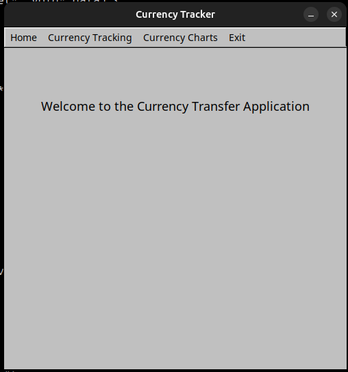
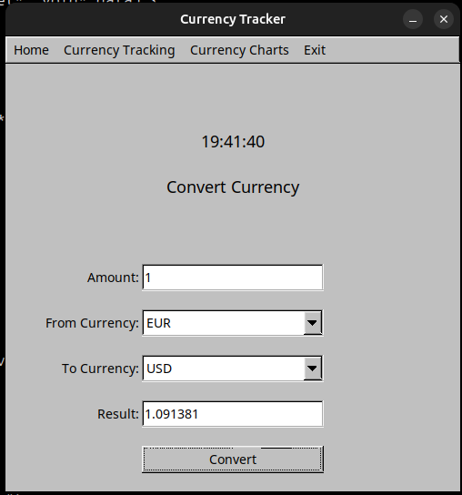
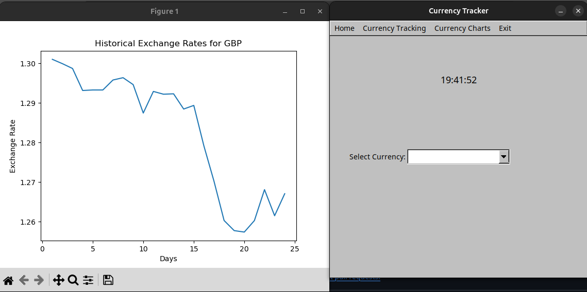

# Currency Tracker Application



## Overview
This is a simple C++ application built using FLTK (Fast Light Toolkit) for GUI, and it uses the CurrencyAPI to fetch real-time and historical currency exchange rates. The application allows users to:
- Convert between different currencies.
- View historical exchange rate trends for selected currencies.

## Features
- **Currency Conversion**: Convert an amount from one currency to another using real-time exchange rates.
- **Historical Data**: View historical exchange rate trends for the past 30 days.
- **User-Friendly Interface**: Simple and intuitive GUI built with FLTK.

## Screenshots

*Home Page of the Application*


*Currency Conversion Page*


*Historical Exchange Rate Chart*

## Dependencies
- **FLTK**: For the graphical user interface.
- **libcurl**: For making HTTP requests to the CurrencyAPI.
- **nlohmann/json**: For parsing JSON responses from the API.
- **matplotlib-cpp**: For plotting historical exchange rate data.

## Installation
1. Clone the repository:
   ```bash
   git clone https://github.com/your-username/CurrencyTracker.git
